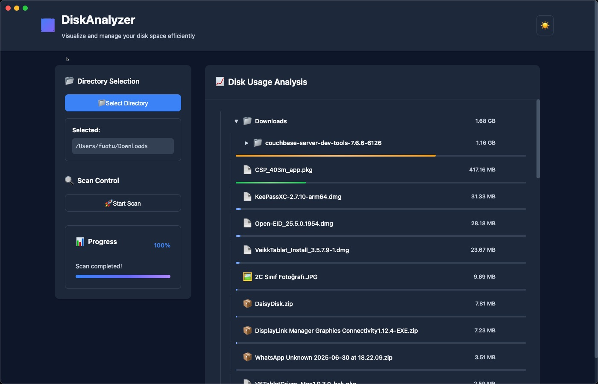

# DiskAnalyzer

A cross-platform disk space analyzer built with Electron and React. DiskAnalyzer helps you visualize disk usage by scanning directories and displaying file/folder sizes in an intuitive interface.



## Features

- 📊 Directory tree scanning with real-time progress
- 📁 Interactive file/folder browser
- 🗑️ Built-in file deletion with confirmation
- 🔍 Open files/folders in system default applications
- 🎯 Lightweight and fast scanning
- 🖥️ Cross-platform support (macOS, Windows, Linux)

## Prerequisites

Before you begin, ensure you have the following installed:

- **Node.js** (version 16 or higher) - [Download here](https://nodejs.org/)
- **npm** (comes with Node.js)
- **Git** - [Download here](https://git-scm.com/)

## Getting Started

### 1. Clone the Repository

```bash
git clone https://github.com/your-username/diskanalyzer-electron.git
cd diskanalyzer-electron
```

### 2. Install Dependencies

```bash
npm install
```

### 3. Run Locally for Development

To start the application in development mode:

```bash
# Build the React components
npm run build

# Start the Electron application
npm start
```

The application will open in a new window. You can make changes to the source code and rebuild to see updates.

## Building for Production

### Build the Application

To create a production build of the React components:

```bash
npm run build
```

This will create a `dist` folder with the compiled React application.

### Create Distribution Packages

To create distribution packages for your platform:

```bash
npm run dist
```

This will create platform-specific installers in the `release` folder:

- **macOS**: `.dmg` file
- **Windows**: `.exe` installer  (not tested)
- **Linux**: `.AppImage` or other formats (not tested)

#### macOS DMG Creation

For macOS specifically, the build process will create a `.dmg` file that users can:

1. Download and mount
2. Drag the app to Applications folder
3. Launch from Applications or Launchpad

The DMG file will be located in `release/` after running `npm run dist`.

## Project Structure

```
diskanalyzer-electron/
├── src/                    # React source files
│   └── App.jsx            # Main React component
├── dist/                  # Built React files (generated)
├── release/               # Distribution packages (generated)
├── main.js               # Electron main process
├── preload.js            # Electron preload script
├── index.html            # HTML entry point
├── style.css             # Global styles
├── Credits.html          # Credits window
├── webpack.config.js     # Webpack configuration
├── .babelrc             # Babel configuration
└── package.json         # Project dependencies and scripts
```

## Development

### Available Scripts

- `npm start` - Run the Electron application
- `npm run build` - Build React components with Webpack
- `npm run dist` - Create distribution packages with electron-builder
- `npm test` - Run tests (currently not implemented)

### Key Technologies

- **Electron** - Desktop application framework
- **React** - UI library
- **Webpack** - Module bundler
- **Babel** - JavaScript compiler
- **electron-builder** - Package and build tools

## Building from Source

1. **Clone and setup:**
   ```bash
   git clone https://github.com/your-username/diskanalyzer-electron.git
   cd diskanalyzer-electron
   npm install
   ```

2. **Development build:**
   ```bash
   npm run build
   npm start
   ```

3. **Production build:**
   ```bash
   npm run build
   npm run dist
   ```


## License

This project is licensed under the MIT License - see the LICENSE file for details.

## Author

**Fuat Ulugay**  
Monitor Consulting OU

---

For more information or support, please open an issue on the GitHub repository.
